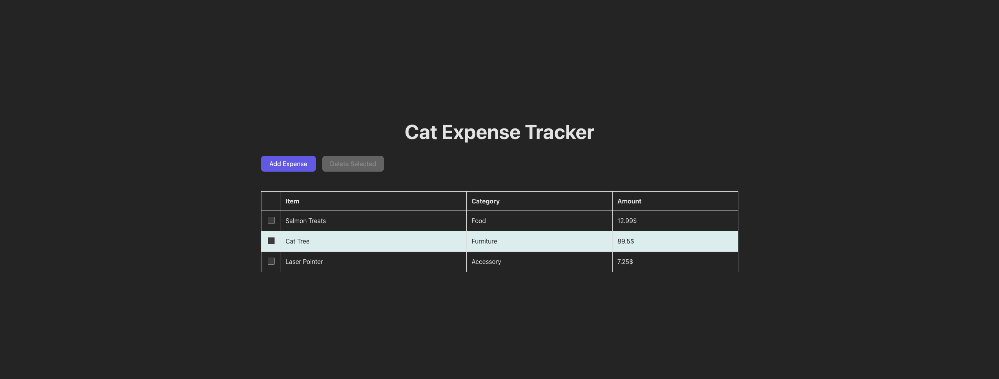
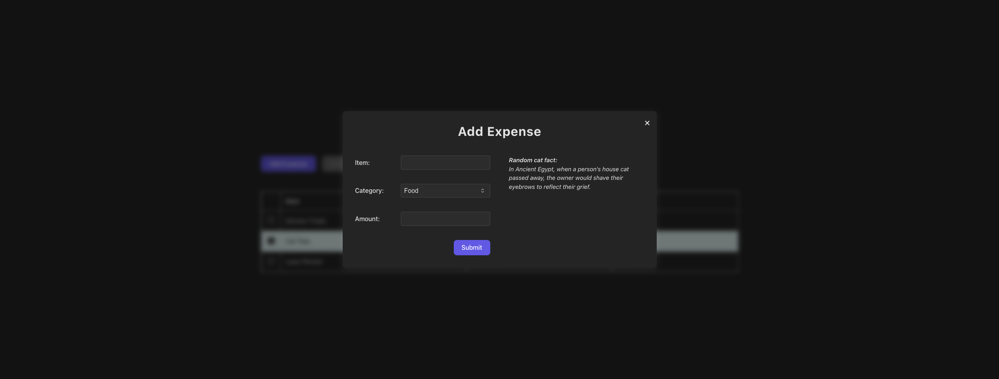
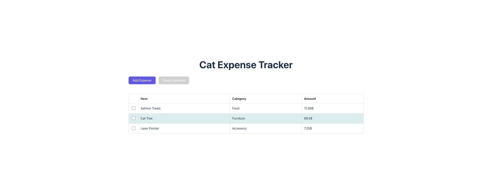
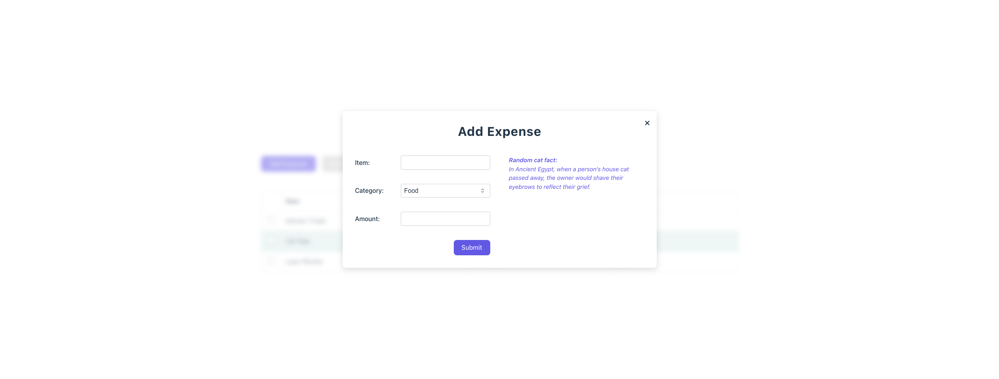

# 😺 Cat Expense Tracker


A simple and delightful React app for tracking your feline-related expenses. Built with **React**, **TypeScript**, and **Vite**, this single-page app allows you to add, delete, and highlight top expense categories — with a dash of cat facts for fun.









---

## ✨ Features

- Add new expenses (with validation & sanitization)
- Select and delete multiple expenses with confirmation
- Highlights highest spending category (or tied categories)
- Random cat fact from [catfact.ninja](https://catfact.ninja/)
- **Adaptive UI** — supports both light and dark themes via `prefers-color-scheme`
- Fully keyboard-accessible and a11y-friendly
- Styled with CSS and custom dropdowns
- No backend — fully client-side, fast, and lightweight

---

## 🚀 Tech Stack

- [React](https://reactjs.org/)
- [TypeScript](https://www.typescriptlang.org/)
- [Vite](https://vitejs.dev/)
- [CSS Modules / vanilla CSS]
- [ESLint](https://eslint.org/) + [Prettier](https://prettier.io/) configured
- Accessible components using `aria-*`, `role`, keyboard support

---

## 📦 Setup

1. **Clone the repo:**
    ```bash
    git clone https://github.com/your-username/cat-expense-tracker.git
    cd cat-expense-tracker
    ```
2. Install dependencies (via pnpm or npm): 
   ```bash
    pnpm install
    # or
    npm install
   ```
3. Run in dev mode:
   ```bash
    pnpm dev
    # or
    npm run dev
   ```
4. Build for production:
   ```bash
    pnpm build
    # or
    npm run build
   ```
5. Preview production build:
   ```bash
   pnpm preview
   # or
   npm run preview
   ```

---

## 🧪 Linting & Formatting
Run ESLint:
```bash
  pnpm lint
```
Automatically fix issues:
```bash
  pnpm lint --fix
```

---

## 🔍 Accessibility (a11y)
- Escape key closes dialogs
- Tab key fully navigable
- Focus is trapped inside modals
- `aria-label`, `aria-modal`, `role="dialog"` used for screen readers
- The cancel button is autofocused in the confirmation dialog

---

## 💡 Author Notes
This was developed as part of a front-end coding assessment. If you're a cat lover, expense nerd, or hiring manager, thanks for checking it out!

---

## 🐱 Random Cat Fact
> _“A cat's jaw has only up and down motion; it does not have any lateral, side-to-side motion like dogs and humans.”_
